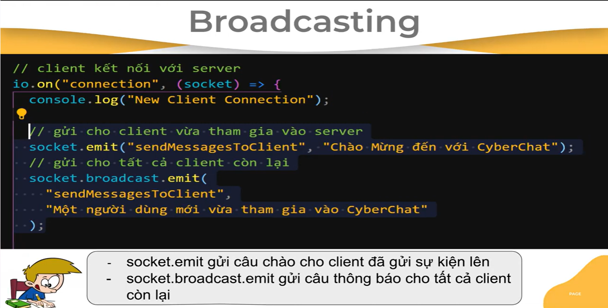
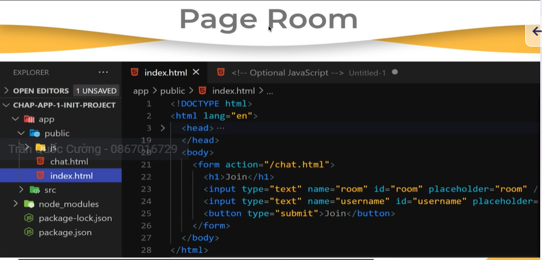

# Khởi tạo dự án

`npm init`
`npm i express`
`npm i nodemon --save-dev`
Khởi tạo 2 folder: app chứa public và src

Cài đặt Socket.io: `npm i socket.io`
Tham khảo:

- [Socket.io-npm](https://www.npmjs.com/package/socket.io)
- [Socket.io](https://socket.io/docs/v4/tutorial/introduction)

# Khởi tạo server bằng http-express


Ớ phía client

Khi client gọi `io();` thì nó đã gửi một event đến server với tên là "connection"

Ở phía server


Cơ chế ổ điện: Khi client C gửi event lên server


- Nếu dùng socket: server chỉ trả về dữ liệu cho client C
- Nếu dùng io: server trả về dữ liệu cho tất cả các client


# Thực hành


## Xử lý Bad-words

Cài đặt: `npm i bad-words`
Tham khảo" [link](https://www.npmjs.com/package/bad-words)


## Chức năng Welcome




## Chức năng Share Location


## Xử lý thời gian gửi tin nhắn

Cài đặt: `npm i date-format`
Tham khảo: [link](https://www.npmjs.com/package/date-format)
Sử dụng:

```
const formatTime = require("data-format");
formatTime("dd/MM/yyyy - hh:mm:ss", new Date());

```



## Xử lý params từ form input


Tham khảo: [link](https://cdnjs.com/libraries/qs)
Nhúng link cdn vào file chat.html để lấy được tham số


